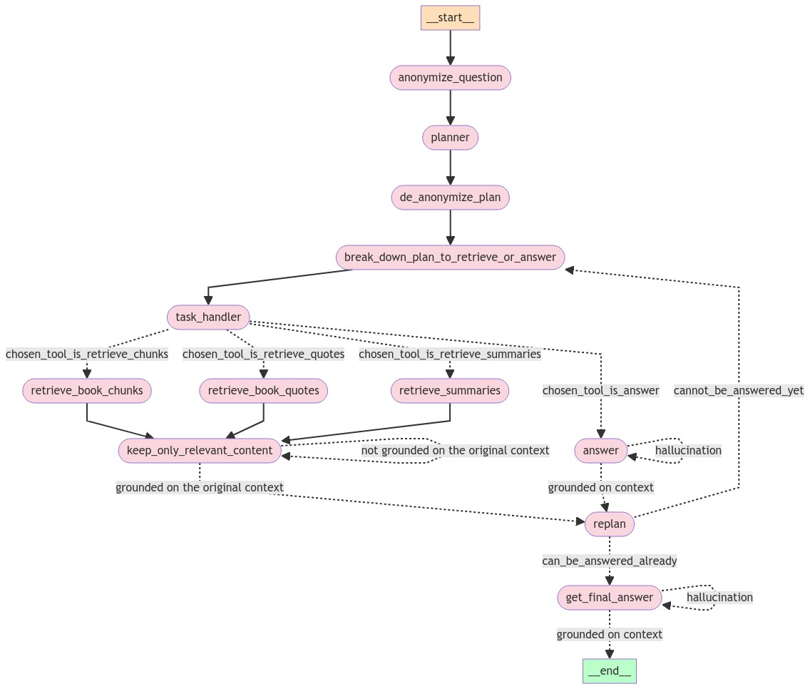

# Sophisticated Controllable Agent for Complex RAG Tasks 🧠📚

This repository showcases an advanced RAG (Retrieval-Augmented Generation) solution designed to tackle complex questions that simple semantic similarity-based retrieval cannot solve. The solution uses a sophisticated deterministic graph, which acts as the "brain" 🧠 of a highly controllable autonomous agent capable of answering non-trivial questions from your own data. The only elements treated as black boxes are the outputs of LLM-based (Large Language Model) functions, and these are closely monitored. Given that the data is yours, it is crucial to ensure that the answers provided are solely based on this data, avoiding any hallucinations.

To achieve this, the algorithm was tested using a familiar use case: the first book of Harry Potter. This choice allows for monitoring whether the model relies on its pre-trained knowledge or strictly on the retrieved information from vector stores.

An indicator of the algorithm's reliability is its ability to fail at answering questions not found in the context. When it successfully answers a question derived from the context, it confirms that the solution is based on the actual data provided. If it fails, it is because the answer could not be deduced from the available data.

### Example of Such Questions 🔍
#### How did the protagonist defeat the villain's assistant?
To solve this question, the following steps are necessary:

1. Identify the protagonist of the plot.
2. Identify the villain.
3. Identify the villain's assistant.
4. Search for confrontations or interactions between the protagonist and the villain.
5. Deduce the reason that led the protagonist to defeat the assistant.

## General Project Flow 📈

1. **PDF Loading and Processing:** Load PDF documents and split them into chapters.
2. **Text Preprocessing:** Clean and preprocess the text for better summarization and encoding.
3. **Summarization:** Generate extensive summaries of each chapter using large language models.
4. **Vector Store Encoding:** Encode the book content and chapter summaries into vector stores for efficient retrieval.
5. **Define Various LLM-Based Functions:** Define functions for the graph pipeline, including planning, retrieval, answering, replanning, content distillation, hallucination checking, etc.
6. **Graph-Based Workflow:** Utilize a state graph to manage the workflow of tasks.
7. **Performance Evaluation:** Evaluate how well the whole solution solved complicated questions.

## Suggested Deterministic Agent Solution Schema 💡



## Algorithm Represented by the Graph 🔗

1. Start with the user's question.<br>
2. Anonymize the question by replacing named entities with variables and storing the mapping.<br>
3. Generate a high-level plan to answer the anonymized question using a language model.<br>
4. De-anonymize the plan by replacing the variables with the original named entities.<br>
5. Break down the plan into individual tasks that involve either retrieving relevant information or answering a question based on a given context.<br>
6. For each task in the plan:<br>
&emsp;&emsp;a. Decide whether to retrieve information or answer a question based on the task and the current context.<br>
&emsp;&emsp;b. If retrieving information:<br>
&emsp;&emsp;&emsp;&emsp;i. Retrieve relevant information from the vector store based on the task.<br>
&emsp;&emsp;&emsp;&emsp;ii. Distill the retrieved information to keep only the relevant content.<br>
&emsp;&emsp;&emsp;&emsp;iii. Verify that the distilled content is grounded in the original context. If not, distill the content again.<br>
&emsp;&emsp;c. If answering a question:<br>
&emsp;&emsp;&emsp;&emsp;i. Answer the question based on the current context using a language model, using chain of thought.<br>
&emsp;&emsp;&emsp;&emsp;ii. Verify that the generated answer is grounded in the context. If not, answer the question again.<br>
&emsp;&emsp;d. After retrieving or answering, re-plan the remaining steps based on the updated context.<br>
&emsp;&emsp;e. Check if the original question can be answered with the current context. If so, proceed to the final answer step. Otherwise, continue with the next task in the plan.<br>
7. Generate the final answer to the original question based on the accumulated context, using chain of thought.<br>
8. Verify that the final answer is grounded in the context. If not, generate the final answer again.<br>
9. Output the final answer to the user.<br>


## Heuristics and Techniques Implemented in This Solution ⚙️

1. Encoding both book content in chunks and chapter summaries generated by LLM.<br>
2. Anonymizing the question to create a general plan without biases or pre-trained knowledge of any LLM involved.<br>
3. Breaking down each task from the plan to be executed by custom functions with full control.<br>
4. Distilling retrieved content for better and accurate LLM generations, minimizing hallucinations.<br>
5. Answering a question based on context using a Chain of Thought, which includes both positive and negative examples, to arrive at a well-reasoned answer rather than just a straightforward response.<br>
6. Content verification and hallucination-free verification as suggested in "Self-RAG: Learning to Retrieve, Generate, and Critique through Self-Reflection" - https://arxiv.org/abs/2310.11511.<br>
7. Utilizing an ongoing updated plan made by an LLM to solve complicated questions. Some ideas are derived from "Plan-and-Solve Prompting" - https://arxiv.org/abs/2305.04091 and the "babyagi" project - https://github.com/yoheinakajima/babyagi.<br>
8. Evaluating the model's performance using `Ragas` metrics like answer correctness, faithfulness, relevancy, recall, and similarity to ensure high-quality answers.<br>

## Installation 🛠️

1. Clone the repository:
    ```sh
    git clone https://github.com/NirDiamant/Deterministic-RAG-Agent.git
    ```

2. Install the required Python packages:
    ```sh
    pip install -r requirements.txt
    ```

3. Set up your environment variables (The models I used were trying to minimize the cost, but this is just a suggestion):
    Create a `.env` file in the root directory and add your API keys:
    ```
    OPENAI_API_KEY=your_openai_api_key
    GROQ_API_KEY=your_groq_api_key
    ```

4. Step-by-Step Tutorial Notebook: The step-by-step tutorial notebook is `sophisticated_rag_agent_harry_potter.ipynb`.

5. Run a Real-Time Visualization of the Agent:
    - Open CMD and type: `streamlit run simulate_agent.py`

## Contributing 🤝

Contributions are welcome! Please feel free to submit a pull request or open an issue for any suggestions or improvements.

## Special Thanks 🎉

Special thanks to Elad Levi for the great advising and ideas.

## License 📜

This project is licensed under the Apache-2.0 License.